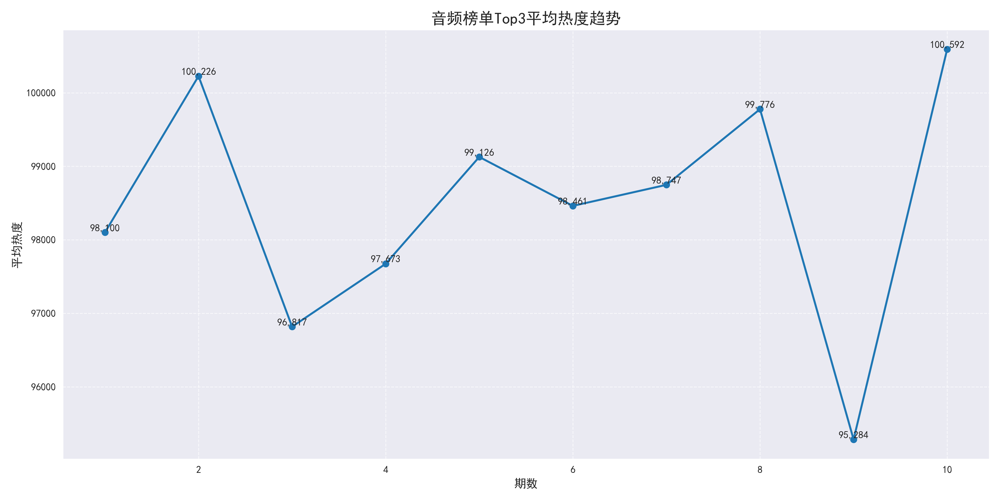
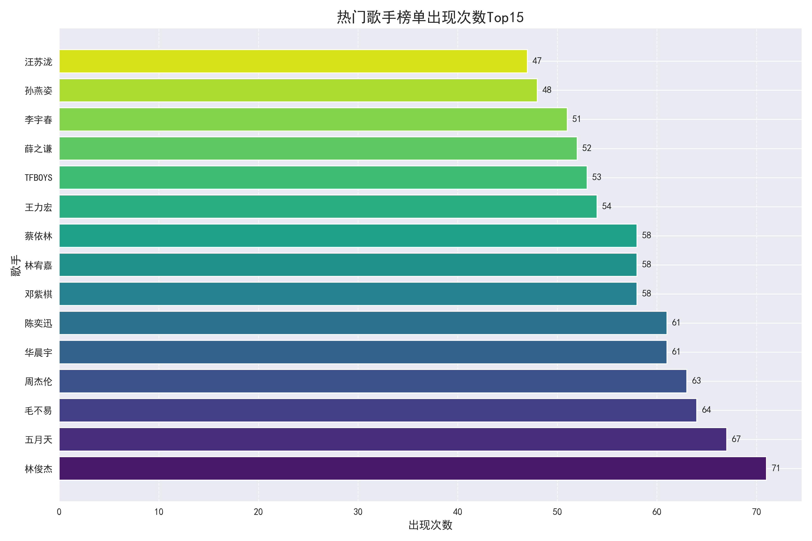
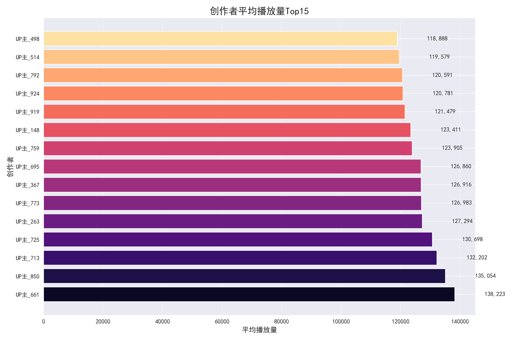

# B站音频榜单数据分析样例

本文档展示了使用Python分析B站音频榜单数据的样例，包含了数据处理、可视化和分析报告生成的完整流程。

## 1. 数据准备与加载

首先，我们需要准备和加载数据。在实际项目中，数据通常来自爬虫采集，这里我们使用假数据进行演示。

```python
import pandas as pd
import numpy as np
import matplotlib.pyplot as plt
import seaborn as sns
import os
from datetime import datetime, timedelta
import random

# 设置中文字体
plt.rcParams['font.sans-serif'] = ['SimHei']  # 设置中文字体
plt.rcParams['axes.unicode_minus'] = False     # 解决负号显示问题

# 创建输出目录
output_dir = './sample_output'
if not os.path.exists(output_dir):
    os.makedirs(output_dir)

# 创建图表目录
charts_dir = os.path.join(output_dir, 'charts')
if not os.path.exists(charts_dir):
    os.makedirs(charts_dir)

# 生成假数据
def generate_sample_data(periods=10, songs_per_period=100):
    """生成样例数据"""
    data = []
    
    # 歌手列表
    singers = ['周杰伦', '林俊杰', '陈奕迅', '薛之谦', '华晨宇', '邓紫棋', 
               'TFBOYS', '李荣浩', '张杰', '王力宏', '五月天', '孙燕姿',
               '林宥嘉', '蔡依林', '张学友', '李宇春', '汪苏泷', '毛不易']
    
    # 歌曲类型
    song_types = ['翻唱', '原创', 'remix', '纯音乐', '现场', '其他']
    
    # 创作类型
    creation_types = ['舞蹈', '翻唱', 'MV', '教程', '游戏', '动画', '直播', '其他']
    
    # 基准日期
    base_date = datetime(2023, 1, 1)
    
    # 为每个期数生成数据
    for period in range(1, periods + 1):
        # 当前期数的日期
        current_date = base_date + timedelta(days=period * 30)
        year = current_date.year
        
        # 为当前期数生成歌曲数据
        for rank in range(1, songs_per_period + 1):
            # 随机选择歌手
            singer = random.choice(singers)
            
            # 生成热度 (排名越高热度越高，并添加一些随机性)
            base_heat = 100000 - (rank * 900) + random.randint(-5000, 5000)
            heat = max(1000, base_heat)
            
            # 生成播放量 (与热度相关但有随机性)
            play_count = heat * random.uniform(0.8, 1.2) + random.randint(1000, 50000)
            
            # 随机选择歌曲类型和创作类型
            song_type = random.choice(song_types)
            creation_type = random.choice(creation_types)
            
            # 生成歌曲ID (确保唯一性)
            music_id = f"music_{period}_{rank}_{random.randint(1000, 9999)}"
            
            # 生成创作者ID和昵称
            creator_id = f"creator_{random.randint(1000, 9999)}"
            creator_nickname = f"UP主_{random.randint(100, 999)}"
            
            # 添加数据项
            data.append({
                'period': period,
                'year': year,
                'date': current_date.strftime('%Y-%m-%d'),
                'rank': rank,
                'music_id': music_id,
                'music_title': f"示例歌曲_{period}_{rank}",
                'singer': singer,
                'album': f"专辑_{random.randint(100, 999)}",
                'heat': heat,
                'creation_title': f"视频_{period}_{rank}",
                'creation_nickname': creator_nickname,
                'creation_play': play_count,
                'creation_duration': random.randint(60, 600),  # 1-10分钟
                'song_type': song_type,
                'creation_type': creation_type
            })
    
    return pd.DataFrame(data)

# 生成样例数据
df = generate_sample_data(periods=10, songs_per_period=100)
print(f"生成的样例数据形状: {df.shape}")
df.head()
```

## 2. 数据预处理

在分析之前，我们需要对数据进行预处理，包括处理缺失值、类型转换和特征工程。

```python
# 数据预处理
def preprocess_data(df):
    """数据预处理"""
    print("正在预处理数据...")
    
    # 处理缺失值
    df = df.fillna({
        'music_title': '未知歌曲',
        'singer': '未知歌手',
        'album': '未知专辑',
        'creation_title': '未知视频',
        'creation_nickname': '未知创作者',
        'creation_play': 0
    })
    
    # 确保数值列的类型正确
    numeric_cols = ['heat', 'rank', 'creation_duration', 'creation_play']
    for col in numeric_cols:
        if col in df.columns:
            df[col] = pd.to_numeric(df[col], errors='coerce')
    
    # 将日期列转换为datetime类型
    if 'date' in df.columns:
        df['date'] = pd.to_datetime(df['date'], errors='coerce')
    
    # 添加新的特征
    # 热度归一化（按期数）
    df['heat_normalized'] = df.groupby('period')['heat'].transform(
        lambda x: (x - x.min()) / (x.max() - x.min()) if x.max() > x.min() else 0
    )
    
    # 计算播放量与热度的比率
    df['play_heat_ratio'] = df['creation_play'] / df['heat']
    
    # 提取视频时长（分钟）
    if 'creation_duration' in df.columns:
        df['duration_minutes'] = df['creation_duration'] / 60
    
    # 计算排名稳定性指标
    df = calculate_rank_stability(df)
    
    print(f"预处理完成，数据形状: {df.shape}")
    return df

def calculate_rank_stability(df):
    """计算排名稳定性指标"""
    # 计算每首歌在不同期数中的排名标准差
    rank_std = df.groupby('music_id')['rank'].agg(['std', 'count']).reset_index()
    rank_std.columns = ['music_id', 'rank_std', 'appearance_count']
    
    # 将排名稳定性信息合并回原数据框
    df = df.merge(rank_std, on='music_id', how='left')
    
    # 对于只出现一次的歌曲，将标准差设为0
    df['rank_std'] = df['rank_std'].fillna(0)
    
    return df

# 预处理数据
df = preprocess_data(df)
```

## 3. 热度趋势分析

首先，我们分析音频榜单的热度趋势，了解不同期数之间的热度变化。

```python
def analyze_heat_trends(df, charts_dir):
    """分析热度趋势"""
    print("分析热度趋势...")
    plt.figure(figsize=(14, 7))
    
    # 计算每期排名前3的平均热度
    top3_heat = df[df['rank'] <= 3].groupby('period')['heat'].mean().reset_index()
    top3_heat = top3_heat.sort_values('period')
    
    # 绘制趋势线
    plt.plot(top3_heat['period'], top3_heat['heat'], marker='o', linewidth=2)
    
    # 添加标签和标题
    plt.title('音频榜单Top3平均热度趋势', fontsize=16)
    plt.xlabel('期数', fontsize=12)
    plt.ylabel('平均热度', fontsize=12)
    plt.grid(True, linestyle='--', alpha=0.7)
    
    # 添加数据标签
    for x, y in zip(top3_heat['period'], top3_heat['heat']):
        plt.text(x, y, f'{int(y):,}', ha='center', va='bottom')
    
    # 保存图表
    plt.tight_layout()
    chart_path = os.path.join(charts_dir, 'heat_trends.png')
    plt.savefig(chart_path, dpi=300)
    plt.close()
    
    return top3_heat, chart_path

# 分析热度趋势
top3_heat, heat_chart = analyze_heat_trends(df, charts_dir)
```



## 4. 歌手分布分析

接下来，我们分析歌手在榜单中的分布情况，找出最受欢迎的歌手。

```python
def analyze_singer_distribution(df, charts_dir):
    """分析歌手分布"""
    print("分析歌手分布...")
    plt.figure(figsize=(12, 8))
    
    # 统计歌手出现次数
    singer_counts = df['singer'].value_counts().head(15)
    
    # 创建横向条形图
    bars = plt.barh(singer_counts.index, singer_counts.values, color=sns.color_palette("viridis", len(singer_counts)))
    
    # 添加数据标签
    for i, bar in enumerate(bars):
        plt.text(bar.get_width() + 0.5, bar.get_y() + bar.get_height()/2, 
                f'{singer_counts.values[i]}', 
                va='center')
    
    plt.title('热门歌手榜单出现次数Top15', fontsize=16)
    plt.xlabel('出现次数', fontsize=12)
    plt.ylabel('歌手', fontsize=12)
    plt.grid(True, axis='x', linestyle='--', alpha=0.7)
    
    # 保存图表
    plt.tight_layout()
    chart_path = os.path.join(charts_dir, 'singer_distribution.png')
    plt.savefig(chart_path, dpi=300)
    plt.close()
    
    return singer_counts, chart_path

# 分析歌手分布
singer_counts, singer_chart = analyze_singer_distribution(df, charts_dir)
```



## 5. 创作者表现分析

我们还可以分析创作者的表现，找出播放量最高的创作者。

```python
def analyze_creation_performance(df, charts_dir):
    """分析创作表现"""
    print("分析创作表现...")
    plt.figure(figsize=(12, 8))
    
    # 计算每个创作者的平均播放量
    creator_data = df.groupby('creation_nickname').agg({
        'creation_play': 'mean',
        'music_id': 'count'
    }).reset_index()
    
    # 筛选出至少有2首歌的创作者
    creator_data = creator_data[creator_data['music_id'] >= 2]
    
    # 按平均播放量排序并取前15
    top_creators = creator_data.sort_values('creation_play', ascending=False).head(15)
    
    # 创建横向条形图
    bars = plt.barh(top_creators['creation_nickname'], top_creators['creation_play'], 
                    color=sns.color_palette("magma", len(top_creators)))
    
    # 添加数据标签
    for i, bar in enumerate(bars):
        plt.text(bar.get_width() + 10000, bar.get_y() + bar.get_height()/2, 
                f'{int(top_creators["creation_play"].iloc[i]):,}', 
                va='center')
    
    plt.title('创作者平均播放量Top15', fontsize=16)
    plt.xlabel('平均播放量', fontsize=12)
    plt.ylabel('创作者', fontsize=12)
    plt.grid(True, axis='x', linestyle='--', alpha=0.7)
    
    # 格式化x轴刻度为更易读的形式
    plt.ticklabel_format(style='plain', axis='x')
    
    # 保存图表
    plt.tight_layout()
    chart_path = os.path.join(charts_dir, 'creator_performance.png')
    plt.savefig(chart_path, dpi=300)
    plt.close()
    
    return top_creators, chart_path

# 分析创作者表现
top_creators, creator_chart = analyze_creation_performance(df, charts_dir)
```



